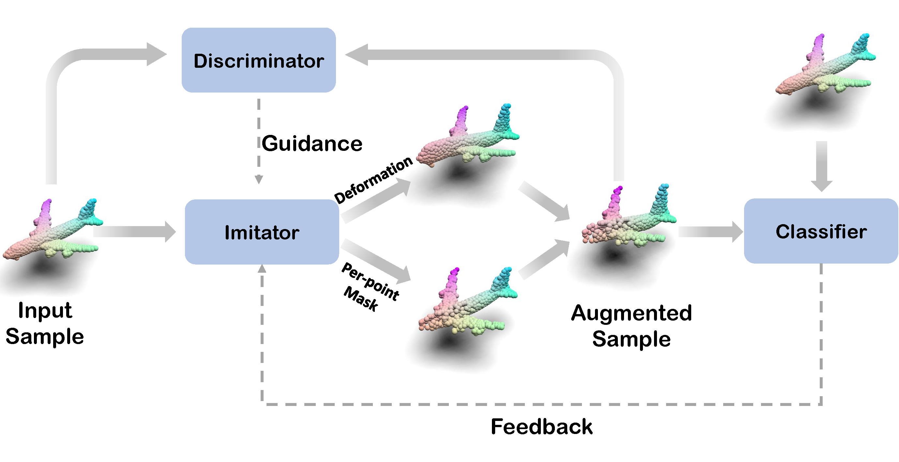
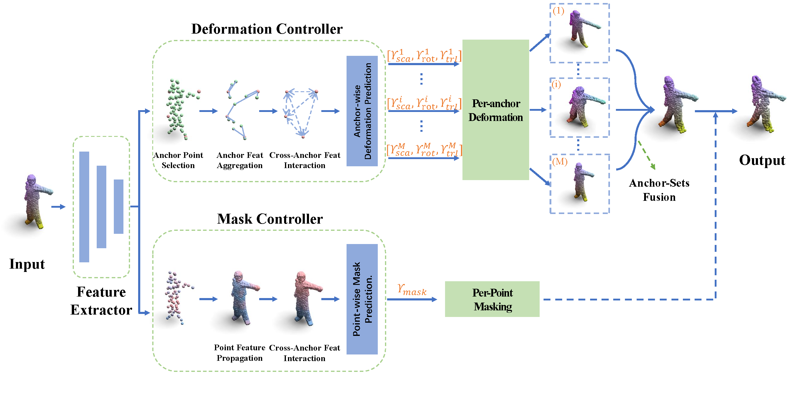

# AdaptPoint: Sample-adaptive Augmentation for Point Cloud Recognition Against Real-world Corruptions [ICCV 2023]
Official implementation of [Sample-adaptive Augmentation for Point Cloud Recognition Against Real-world Corruptions](https://arxiv.org/abs/2309.10431).

The paper has been accepted by **ICCV 2023**.

## Introduction
Robust 3D perception under corruption has become an essential task for the realm of 3D vision. While current data augmentation techniques usually perform random transformations on all point cloud objects in an offline way and ignore the structure of the samples, resulting in over-or-under enhancement. In this work, we propose an alternative to make sample-adaptive transformations based on the structure of the sample to cope with potential corruption via an auto-augmentation framework, named as AdaptPoint.  Specially, we leverage a  imitator, consisting of a Deformation Controller and a Mask Controller, respectively in charge of predicting deformation parameters and producing a per-point mask, based on the intrinsic structural information of the input point cloud, and then conduct corruption simulations on top. Then a discriminator is utilized to prevent the generation of excessive corruption that deviates from the original data distribution. In addition, a perception-guidance feedback mechanism is incorporated to guide the generation of samples with appropriate difficulty level. Furthermore, to address the paucity of real-world corrupted point cloud, we also introduce a new dataset ScanObjectNN-C. Experiments show that our method achieves state-of-the-art results on multiple corruption benchmarks including ModelNet-C, our ScanObjectNN-C, and ShapeNet-C.

<div align="center">
  
</div>

<div align="center">
  
</div>


## Requirements

### Install 
```
# Create a new conda environment
conda create -n adaptpoint python=3.8 -y

# install CUDA 11.3 torch 1.12
pip install torch==1.12.1+cu113 torchvision==0.13.1+cu113 torchaudio==0.12.1 --extra-index-url https://download.pytorch.org/whl/cu113

# install requirements
pip install -r requirements.txt

# install cpp extensions, the pointnet++ library
cd openpoints/cpp/pointnet2_batch
python setup.py install
cd ../

# grid_subsampling library. necessary only if interested in S3DIS_sphere
cd subsampling
python setup.py build_ext --inplace
cd ..


# point transformer library. Necessary only if interested in Point Transformer and Stratified Transformer
cd pointops/
python setup.py install
cd ..

# Blow are functions that optional. Necessary only if interested in reconstruction tasks such as completion
cd chamfer_dist
python setup.py install
cd ../emd
python setup.py install
cd ../../../
```

### Dataset
#### ScanObjectNN
Download [ScanObjectNN](https://drive.google.com/uc?id=1iM3mhMJ_N0x5pytcP831l3ZFwbLmbwzi) and unzip the folder under ```./data/ScanObjectNN```.
The directory structure should be:
```
|data/
|--- ...
|--- ScanObjectNN
    |--- h5_files
        |--- main_split
            |--- training_objectdataset_augmentedrot_scale75.h5
            |--- test_objectdataset_augmentedrot_scale75.h5
```
#### ScanObjectNN-C
Download [ScanObjectNN-C](https://drive.google.com/drive/folders/1CD_jOlXUqx_out7xoph_Ymz7EaHgElLW?usp=sharing) dataset and unzip the folder under `./data/ScanObjectNN_C`. The directory structure should be:
```
│data/
|--- ...
|--- ScanObjectNN_C/
    |--- scanobjectnn_c/
        |--- scale_0.h5
        |--- ...
        |--- scale_4.h5
```
## Get Started
### ScanObjectNN-C

```
CUDA_VISIBLE_DEVICES=0 python examples/classification/main.py --cfg cfgs/scanobjectnn/pointnext-s_adaptpoint_1.yaml
```

## Acknowlegment
This repo benefits from [ModelNet-C](https://github.com/jiawei-ren/ModelNet-C), [PointCloud-C](https://github.com/ldkong1205/PointCloud-C) and the excellent codebase [PointNext](https://github.com/guochengqian/PointNeXt). Thanks for their wonderful works. 

We would like to thank Lingdong Kong and Jiawei Ren for their helpful discussions.


## Citation
```bash

```

## Contact
If you have any question about this project, please feel free to contact jwang991020@gmail.com.
